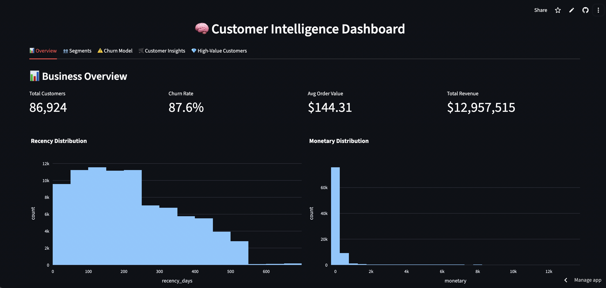

<h1>🧠 Customer 360 & Churn Intelligence Dashboard (Olist Ecommerce)</h1>

  

A full end-to-end analytics project including churn modelling, segmentation, and product recommendations.

📌 Overview

This project builds a complete Customer Intelligence System using the Olist e-commerce dataset (Brazil).
It includes:

✔ Customer 360 feature engineering

Recency, Frequency, Monetary (RFM)

Avg order value

Freight ratio

Review behavior

Derived churn labels using future-purchase logic

✔ Customer Segmentation

KMeans clustering

Normalised profile radar chart

Segment-level comparisons (monetary, recency, churn risk, etc.)

✔ Churn Modelling

Random Forest classifier

ROC curve + AUC

Feature importance insights

Customer-level churn probability lookup

✔ Product Recommendations (Next-Best-Offer)

Market Basket Analysis (Apriori)

SKU-level association rules

Customer-specific cross-sell suggestions

✔ Interactive Streamlit Dashboard

5-tab interface:

Overview

Segments

Churn Model

Customer Insights

High-Value Customers

📂 Project Structure
customeranalytics/
│
├── dashboard/
│     └── app.py                   <- Streamlit dashboard
│
├── data/                          <- Notebook output data
│     ├── cust_agg.csv
│     ├── orders.csv
│     ├── order_items.csv
│     └── olist_products_dataset.csv
│
├── notebooks/
│     └── olist_customer_360.ipynb <- Full analysis notebook (Customer360)
│
├── requirements.txt               <- Python dependencies
└── README.md

Dashboard link: [https://olist-analysis-dashboard.streamlit.app/](url)

🚀 How to Run the Dashboard Locally
1. Create virtual environment
python3 -m venv env
source env/bin/activate

2. Install dependencies
pip install -r requirements.txt

3. Run Streamlit
streamlit run dashboard/app.py

Dashboard opens at:
👉 http://localhost:8501/

🧮 Key Insights from the Analysis
🔹 Segments

Clear behavioural clusters emerged based on spending, recency, frequency.

One segment shows high monetary value + high repeat rate → retention priority.

🔹 Churn Drivers

Random Forest showed freight_ratio & order value patterns provide the strongest predictive signal.
Review score also contributes moderately.

🔹 NBO (Next Best Offer)

Category pairs like cama_mesa_banho ↔ casa_conforto show strong cross-sell potential

“informatica_acessorios” shows repeated same-category association

Recommendations are fed into the Customer Insights tab

🔹 High-Value Customers

Top 50 customers by lifetime spend + churn probability help identify who needs retention campaigns.

📎 Dataset Source

The data is from the public Olist Kaggle dataset:
https://www.kaggle.com/datasets/olistbr/brazilian-ecommerce

📘 License

MIT License.

🤝 Author

Jasper Thanapal
Customer Analytics | Data Science | Supply Chain Insights
